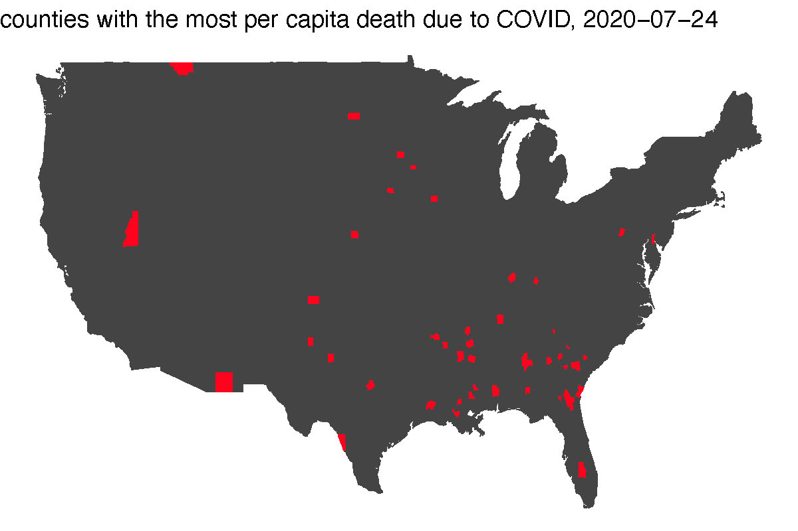

##  { .white }


<p class="white" style="font-size:100px" align=center>
Welcome to<br>DS 202
</p>


## Course overview {.shout}

## What is this course about?

* Data Acquisition
    + data ingestion: flat files, databases, websites, other (binary) sources
    + ethical issues
* Data Exploration
    + numerical and graphical summaries
    + types of graphics and good visualization practices
    + (simple) modeling
* Data Management
    + Data understanding
    + Data cleaning
    + Pipeline: filtering, transformation, aggregation, and reshaping
    
## What is this course about? (cont'd)
    
* Communicating Findings
    + Writing reports 
    + Data visualization (again!)
    + Web-based applets
* Collaborating on an Analysis
* Reproducibility/Repeatability of Findings
    

## What is exploratory data analysis?

Typical data science project:


## A map created by R


## ... we will be using R for that! {.shout}

## R is ...

* One of the most popular data science programming languages
* __Free__ to use, __open source__ so you can see what code is doing to your data
* __Powerful__ for data analysis
    * With the right tools, get more work done, faster.
* __Extensible__: Over 16000 user contributed add-on packages currently on CRAN! Bioconductor has more than 1800 packages. Many researchers provide R packages through github.
* __Flexible__
    * Not a question of _can_, but _how_.

```{r, eval = FALSE, echo = FALSE}
devtools::install_github("metacran/crandb")
pkgs <- crandb::list_packages(limit = 999999)
length(pkgs)
# [1] 15352
```

## At the end of the course ...
you will acquire solid skills towards a real-world data analytic pipeline. This includes 

- knowledge about the basic programming principles of R
- data acquisition in different formats and from different sources
- implementation of a data pipeline -- clean, wrangle, explore, and repeat
- visualization of data in different forms
- communication of your findings in a reproducible form as report

## Class format
- flipped format
- everything delivered remotely
- study groups will be formed

## In a typical week, you will ...

- study recorded lecture videos by Monday;
- finish individual quiz by Monday; 
- attempt an identical group quiz in class on Tuesday;
- during Tuesday's meeting, participate in demonstrations, group case studies, and lab activities
- work on weekly assignment in Thursday's meeting
- hand in your assignment by the next Monday.

## Getting Help

There's lots of ways to get help in case you are stuck:

1. Ask the instructor and the TA during Thursday's class
2. Ask a groupmate
3. Post on Piazza
4. Attend remote office hours
5. Use online resources. In particular, answers from stackoverflow and R help are usually helpful.

## Piazza

[Piazza](https://piazza.com/iastate/fall2020/ds202) will be used as the class' online forum, which is assessible within Canvas. 

## Asking a good question

is a learned and valuable skill!

Have a look at:

- stackoverflow's [Asking a good question](http://stackoverflow.com/help/how-to-ask)

<!-- ## What do you know already? -->

<!-- - excel? -->
<!-- - a programming language?  -->
<!-- - SAS? R? R markdown? -->
<!-- - database theory? third normal form? -->

## What data will we look at?

- **Sports** e.g. college football
- **Crime data** incl. type, time, place etc.
- **Health** e.g. disease rates
- **Movies** e.g. ratings/box office revenues
- **Travel data**, e.g. US flights
- **Environmental Data**: Pollution, Fuel Economy, CO2 Emissions
- **Societal Data**:  Social indicators, Economy, ...
- **I'd like to know what data you are interested in!** 


<!-- Anything else you can think of? -->


<!-- ## What data will we look at? -->

<!-- Go to Google Forms to let me know your favorites and make suggestions: -->
<!-- https://forms.gle/j3cWwu3Q9Be33e7T6 -->


## Syllabus

The full syllabus is [here](https://xdaiisu.github.io/ds202materials/syllabus/syllabus.pdf). It can also be found on Canvas.


<!-- ## An example of Exploratory Data Analysis: mind the gap! -->

<!-- [GapMinder at TED 2006](https://www.youtube.com/watch?v=hVimVzgtD6w) presented by Hans Rosling (1948 - 2017) -->

<!-- - preconceived notions are problematic -->
<!-- - up-to-date data helps us learn about the world -->

<!-- ... let's try this out ... -->

<!-- ## Your Turn {.white} -->

<!--  -->


<!-- - <font color="white">Follow the link to open Gapminder tools at https://www.gapminder.org/tools/#_chart-type=bubbles</font> -->
<!-- - <font color="white">Recreate Hans Rosling's chart of life expectancy (y-axis) by fertility rate (x-axis) and move the slider over time.</font> -->
<!-- - <font color="white">Using this chart, can you find evidence for the AIDS epidemic in Africa? The civil war in Nigeria? The earth quake in Haiti?</font> -->
<!-- - <font color="white">What is the worldwide income distribution in 2015? How does the actual income distribution in 2015 compare to the projection from the World Bank made in 2003 (8:25 in the video)? What accounts for the difference? -->
<!-- </font>xample of Exploratory Data Analysis: mind the gap! -->

<!-- [GapMinder at TED 2006](https://www.youtube.com/watch?v=hVimVzgtD6w) presented by Hans Rosling (1948 - 2017) -->

<!-- - preconceived notions are problematic -->
<!-- - up-to-date data helps us learn about the world -->

<!-- ... let's try this out ... -->

<!-- ## Your Turn {.white} -->

<!--  -->


<!-- - <font color="white">Follow the link to open Gapminder tools at https://www.gapminder.org/tools/#_chart-type=bubbles</font> -->
<!-- - <font color="white">Recreate Hans Rosling's chart of life expectancy (y-axis) by fertility rate (x-axis) and move the slider over time.</font> -->
<!-- - <font color="white">Using this chart, can you find evidence for the AIDS epidemic in Africa? The civil war in Nigeria? The earth quake in Haiti?</font> -->
<!-- - <font color="white">What is the worldwide income distribution in 2015? How does the actual income distribution in 2015 compare to the projection from the World Bank made in 2003 (8:25 in the video)? What accounts for the difference? -->
<!-- </font> -->
