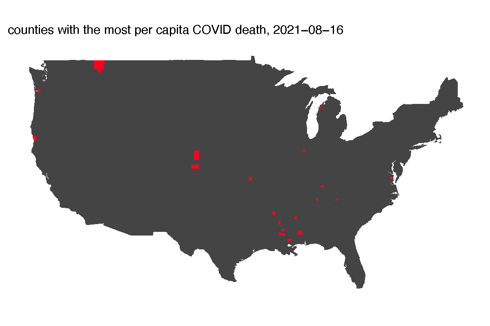
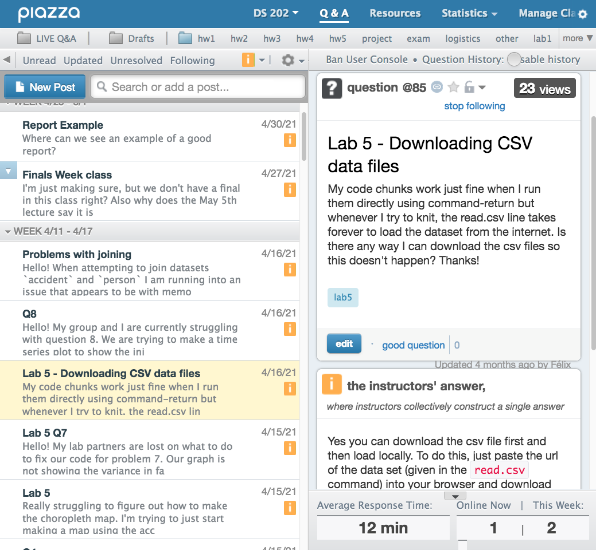

##  { .white }


<p class="white" style="font-size:100px" align=center>
Welcome to<br>DS 202
</p>


## Course overview {.shout}

## for your data science career...

- DS 202 is the second class for Data Science major/minor/certificate
- You will learn very important skills to deal with data. These skills will be repeatedly used in your data science career!
- You will learn R
- You will learn exploratory data analysis

## What is exploratory data analysis?

Typical data science project:


## What is this course about?

* Data Acquisition
    + data ingestion: flat files, databases, websites, other (binary) sources
    + ethical issues
* Data Exploration
    + numerical and graphical summaries
    + types of graphics and good visualization practices
    + (simple) modeling
* Data Management
    + Data understanding
    + Data cleaning
    + Pipeline: filtering, transformation, aggregation, and reshaping
    
## What is this course about? (cont'd)
    
* Communicating Findings
    + Writing reports 
    + Data visualization (again!)
    + Web-based applets
* Collaborating on an Analysis
* Reproducibility/Repeatability of Findings
    

## ... we will be using R for that! {.shout}


## A map created by R


## R is ...

* One of the most popular data science programming languages
* __Free__ to use, __open source__ so you can see what code is doing to your data
* __Powerful__ for data analysis
    * With the right tools, get more work done, faster.
* __Extensible__: More than 18000 user contributed add-on packages currently on CRAN! Bioconductor has almost 2000 packages. Many researchers provide R packages through github.
* __Flexible__
    * Not a question of _can_, but _how_.

```{r, eval = FALSE, echo = FALSE}
devtools::install_github("metacran/crandb")
pkgs <- crandb::list_packages(limit = 999999)
length(pkgs)
# [1] 15352
```


## Why to learn R when we have Python?

- R is built by statisticians and is great for data analysis
- R can create excellent visualization
- R is a functional programming language, so you can write short code to do a massive lot 


## At the end of the course ...
you will acquire solid skills towards a real-world data analytic pipeline. This includes 

- knowledge about the basic programming principles of R
- data acquisition in different formats and from different sources
- implementation of a data pipeline -- clean, wrangle, explore, and repeat
- visualization of data in different forms
- communication of your findings in a reproducible form as report


## Course logistics

- Bring your laptop to the lecture
- Please wear a mask in class,
- and be vaccinated if you can

## Getting help

- In class: Raise your hand. If you need help with your code, use the [office hour Zoom link](https://iastate.zoom.us/j/93009772568?pwd=aWlWWHN0SmN2U011K3BiejhFK3E4Zz09) and share your screen.
- Office hour: Office hour will be held on Zoom [here](https://iastate.zoom.us/j/93009772568?pwd=aWlWWHN0SmN2U011K3BiejhFK3E4Zz09). During my office hour, I will physically be on the turf south of the Parks Library.
- We will also use Piazza for other course-related Q & A 

## Piazza

[Piazza](https://piazza.com/iastate/fall2021/ds202) will be used as the class' online forum, which is assessible within Canvas. 

##



## Asking a good question

is a learned and valuable skill!

Have a look at:

- stackoverflow's [Asking a good question](http://stackoverflow.com/help/how-to-ask)

<!-- ## What do you know already? -->

<!-- - excel? -->
<!-- - a programming language?  -->
<!-- - SAS? R? R markdown? -->
<!-- - database theory? third normal form? -->


## What data will we look at?

Go to Google Forms to let me know your favorites and make suggestions:
https://forms.gle/oWABftKzyfy2Skdp7

<!-- Anything else you can think of? -->


<!-- ## What data will we look at? -->

<!-- Go to Google Forms to let me know your favorites and make suggestions: -->
<!-- https://forms.gle/j3cWwu3Q9Be33e7T6 -->


## Syllabus

The [full syllabus](https://canvas.iastate.edu/courses/85495/pages/syllabus-and-course-schedule?module_item_id=3912529) can be found on Canvas, where you can also find a course schedule.


## Final project
[Project requirements](https://canvas.iastate.edu/courses/85495/pages/final-project-requirements?module_item_id=3912643) can be found on Canvas

## An example of Exploratory Data Analysis: mind the gap!

[GapMinder at TED 2006](https://www.ted.com/talks/hans_rosling_the_best_stats_you_ve_ever_seen#t-363463) presented by Hans Rosling (1948 - 2017)

- preconceived notions are problematic
- up-to-date data helps us learn about the world

... let's try this out ...

## Your Turn {.white}


- <font color="white">Follow the link to open Gapminder tools at https://www.gapminder.org/tools/#_chart-type=bubbles</font>
- <font color="white">Recreate Hans Rosling's chart of life expectancy (y-axis) by fertility rate (x-axis) and move the slider over time.</font>
- <font color="white">Using this chart, can you find evidence for the AIDS epidemic in Africa? The civil war in Nigeria? The earth quake in Haiti?</font>
- <font color="white">What is the worldwide income distribution in 2015? How does the actual income distribution in 2015 compare to the projection from the World Bank made in 2003 (8:25 in the video)? What accounts for the difference?


<!-- </font>xample of Exploratory Data Analysis: mind the gap! -->

<!-- [GapMinder at TED 2006](https://www.youtube.com/watch?v=hVimVzgtD6w) presented by Hans Rosling (1948 - 2017) -->

<!-- - preconceived notions are problematic -->
<!-- - up-to-date data helps us learn about the world -->

<!-- ... let's try this out ... -->

<!-- ## Your Turn {.white} -->

<!--  -->


<!-- - <font color="white">Follow the link to open Gapminder tools at https://www.gapminder.org/tools/#_chart-type=bubbles</font> -->
<!-- - <font color="white">Recreate Hans Rosling's chart of life expectancy (y-axis) by fertility rate (x-axis) and move the slider over time.</font> -->
<!-- - <font color="white">Using this chart, can you find evidence for the AIDS epidemic in Africa? The civil war in Nigeria? The earth quake in Haiti?</font> -->
<!-- - <font color="white">What is the worldwide income distribution in 2015? How does the actual income distribution in 2015 compare to the projection from the World Bank made in 2003 (8:25 in the video)? What accounts for the difference? -->
<!-- </font> -->


<!-- ## Let's form study groups {.shout} -->

<!-- ## Distributing talents -->
<!-- - Who have 3+ years of work experience?  -->
<!-- - Who have international experience?  -->
<!-- - Who have 3+ years of programming experience?  -->
<!-- - Who are non-engineering and non-science students?  -->
<!-- - Science students? -->
<!-- - Engineering students? -->

<!-- ## Introduce yourself to the groupmates -->

<!-- Next up, break into groups and introduce yourselves. Consider including the following points: -->

<!-- - name -->
<!-- - major -->
<!-- - what do you want to do after graduation -->
<!-- - why are you taking this class -->
