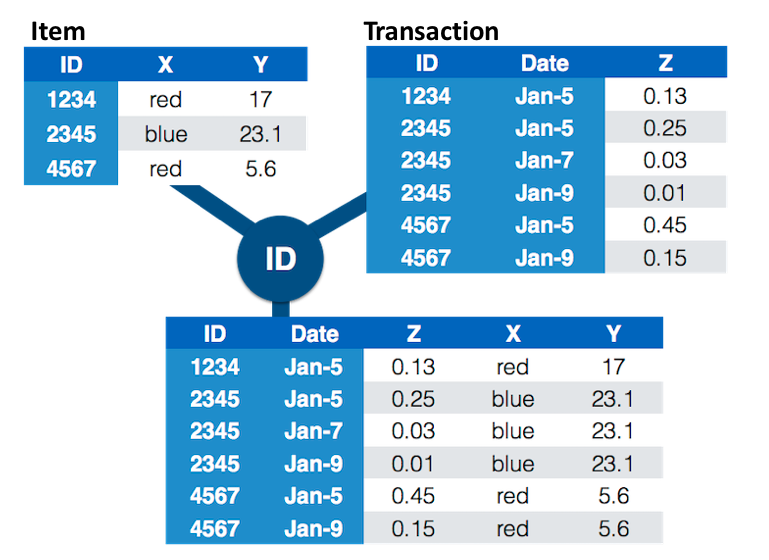

```{r, include=FALSE}
knitr::opts_chunk$set(warning=FALSE)
```

## Joining Data Frames {.shout}


## Outline

- Joining data records using `dplyr`
- Mutating joins
- Filtering joins

## Joins - idea: Data in multiple tables



## Joins - more specific idea

- Data sets are joined along values of variables. 
- **Mutating joins** add new variables to one data frame from matching observations in another. `dplyr` offers `inner_join`, `left_join`, `right_join`, and `full_join`
- **Filtering joins** filter observations from one data frame based on whether or not they match an observation in the other table. `dplyr` offers `semi-join` and `anti-join`

## Mutating Joins {.shout}

##

```{r, message=FALSE}
library(dplyr)
df1 <- data.frame(id = 1:6, trt = rep(c("A", "B", "C"), rep=c(2,1,3)), value = c(5,3,7,1,2,3))
df1
```

```{r}
df2 <- data.frame(id=c(4,4,5,5,7), stress=c(0,1,0,1,0), bpm = c(65, 125, 74, 136, 48))
df2
```    

## Inner join

- Only matches from both data sets are kept
- if multiple records are joinnable, all will be joined and included in the result. This is a common behavior of mutating join functions
```{r}
inner_join(df1, df2, by = "id")
```

## Left join

- `left_join`: all elements in the *left* dataset are kept, no matter whether they are joined to the right data set
- non-matches are filled in by `NA`
- `right_join` works symmetric

```{r}
left_join(df1, df2, by="id")
```


## Full join

- all ids are kept, missings are filled in with `NA`

```{r}
full_join(df1, df2, by = "id")
```

## Filtering Joins {.shout}

## Semi join

- a convenient function in `dplyr`
- `semi_join(x, y)` **keeps** all observations in `x` that have a match in `y`

```{r, message=FALSE}
semi_join(df1, df2)
```

## Anti join

- `anti_join(x, y)` **drops** all observations in `x` that have a match in `y`
- careful, not symmetric!  

```{r}
anti_join(df1, df2, by="id") # no values for id in df2
anti_join(df2, df1, by="id") # no values for id in df1
```

## A few remarks...

- sometimes we unexpectedly cannot match values: missing values, different spelling, ... 
- join can be along multiple variables, e.g. `by = c("Name", "Opponent_Opponent")`
- joining variable(s) can have different names, e.g. `by = c("Name" = "PlayerName")`
- always make sure to check data before and after a join


## The 2019 Cyclone football data

An excerpt of the Cyclone football player data is available in this [excel file](cyclonesFootball2019.xlsx). 
The following command loads the defense data into your R session:

```{r, message=FALSE}
library(dplyr)
library(readxl)
defense <- read_excel('cyclonesFootball2019.xlsx', sheet='Defensive')
str(defense)
```

## R demo...


## Your turn (10 mins) {.white}


<span style="color:white">For this your turn use the Cyclone football data. 

<span style="color:white">
 Load the `defense` and `offense` data from cyclonesFootball2019.xlsx. </br>
 Join (relevant pieces of) the `defense` data set and the `offense` data, so that the defensive and offensive statistics for each player in each game are on the same row. Which column(s) should you join? </br>
 Find the players who contributed to both defence and offence.</br>
 Among the offensive players, who plays the best defense?</br></span>

