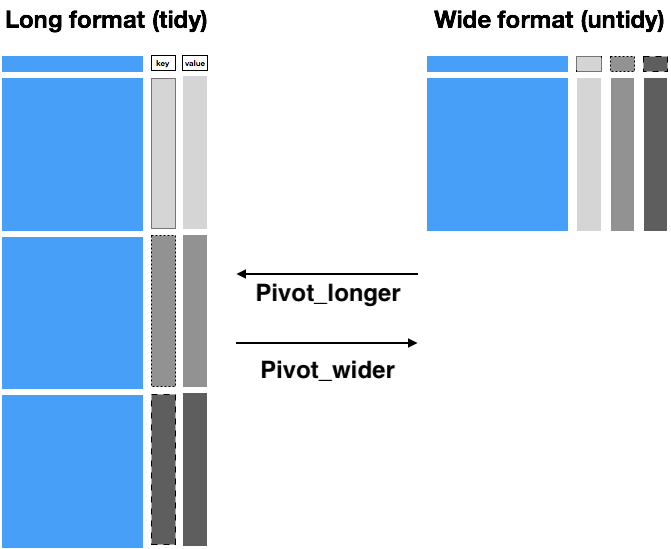
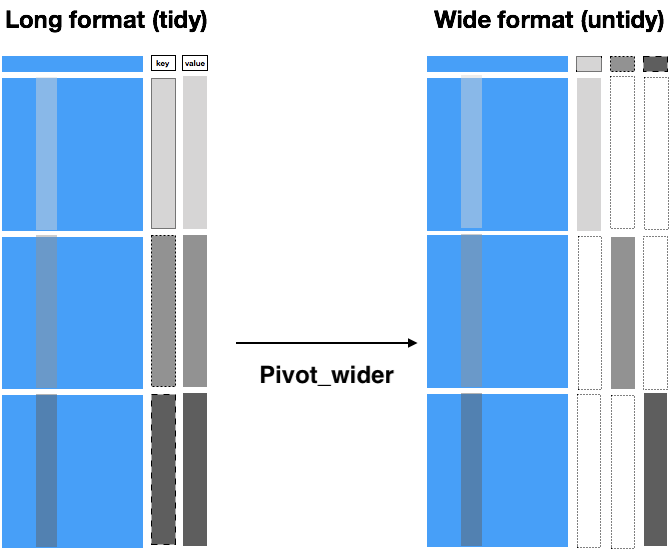

```{r setup, include=FALSE}
knitr::opts_chunk$set(echo = TRUE, warning = FALSE, message =FALSE, cache=TRUE)
library(tidyverse)
data(french_fries, package="reshape2")
```

## Tidying Data Frames with the `tidyr` package {.shout}

## What is tidy data?

> Happy families are all alike; every unhappy family is unhappy in its own way.<br>
-- Leo Tolstoy


> Tidy datasets are all alike, but every messy dataset is messy in its own way.<br>
-- Hadley Wickham


- Resource: tidyr vignette 
`vignette("tidy-data", package="tidyr")`
<!-- - vignette is a version of the [tidy data paper](https://www.jstatsoft.org/article/view/v059i10) -->
- "tidy" means it will suit most (but not all) purposes for downstream analysis

## Outline

- Three sources of messiness
- Key-Value pairs
- `tidyr`: `pivot_wider` and `pivot_longer`
<!-- - `tidyr`: `separate`, `drop_na` -->

## Sources of Messiness {.shout}

## Sources of Messiness

1. Column headers are values, not variable names.<br>
e.g. *treatmenta, treatmentb* <br>
2. Multiple variables are stored in one column.<br>
e.g. *"Fall 2015", "Spring 2016"* or <br>
*"1301 8th St SE, Orange City, Iowa 51041
(42.99755, -96.04149)"*
3. Missing values

## Solving the 1st form of messiness: Pivoting {.shout}

## Data is usually in a spreadsheet format, but ...

there's different ways of encoding the same information:

Option #1
```{r echo = FALSE}
read.csv("data/preg.csv")
```

Option #2
```{r echo = FALSE}
read.csv("data/preg2.csv")
```

Neither #1 nor #2 are "tidy" versions of the data: observed information is part of the column names; some implicit information is assumed

## Tidy version of the example

```{r echo = FALSE}
preg2 <- read.csv("data/preg2.csv")
preg2 %>% pivot_longer(-treatment, names_to='patient', values_to='score') %>% 
  mutate(patient = gsub("\\.", " ", patient))
```

- `treatment` and `patient` uniquely describe a single row in the dataset.
- `treatment` and `patient` are **key variables**,
- `score` is a **measurement variable**
- this makes `treatment-patient` and `score` a **key-value pair**


## Key-value pairs

**Key-Value pairs** - also *attribute-value*, *field-value*, *name-value*:
abstract data representation that allows a lot of flexibility  

One way of telling whether a data set is tidy is to check that all keys for a value are aligned in one row:

| | |
|:------------- |:------------- | 
| | |
|  |      | 
|Untidy data | Tidy data |

## Pivoting data - Plan of attack

Only two functions are needed for pivoting data:

- `pivot_longer(data, cols, names_to, values_to, ...)`: take multiple columns and collapse into key-value pairs <br>
- `pivot_wider(data, id_cols, names_from, values_from, ...)`: pivot a key-value pair across multiple columns.
- What key-value pair to use is often dependent on the analysis to be done.


## French fries data

```{r,message=FALSE}
library(reshape2)
library(dplyr)
data(french_fries, package="reshape2")
french_fries <- as_tibble(french_fries)
```

- data from sensory experiment conducted at Iowa State University in 2004
- investigators were interested in comparing effects of three different fryer oils on taste of fries

```{r}
french_fries
```


## pivot_longer 

```{r}
library(tidyr)
ffm <- french_fries %>% 
  pivot_longer(potato:painty, names_to = 'scale', values_to='score')
ffm
```

## pivot_wider

```{r}
ffm %>% 
  pivot_wider(names_from='treatment', values_from='score')
```

## pivot_wider as the inverse of pivot_longer



## A long format is useful: Distributions of the scales
```{r, fig.height=4}
ggplot(ffm, aes(x=score)) + 
  geom_histogram() + 
  facet_wrap(~scale, scales='free_y')
```


## A wide format is useful: 1st vs 2nd treatment

```{r, fig.height=4}
ffm %>% pivot_wider(names_from='treatment', values_from='score') %>%
  ggplot(aes(x = `1`, y = `2`)) + geom_point() +
  facet_wrap(~scale) + 
  geom_abline(intercept = 0, slope = 1, colour = "grey50")
```


## R demo...


## Your turn {.white}


<span style="color:white"> Load the French fries data using `data("french_fries", package="reshape2")` </span>

<span style="color:white">
 Use `pivot_longer` from  `tidyr`  to combine the different scales for assessing french fries into a single variable. Call the key-value pair "scale" and "score". </br>
 Use `pivot_wider` to get a format in which you can directly compare scale values in week 1 and week 10. Plot a scatterplot of values in week 1 against week 10 and facet by treatment and scale. Do subjects tend to be consistent over time? Which scales show more consistency?
</span>


## Where `pivot_wider` is tricky

- `pivot_wider` is (almost) the inverse operation of `pivot_longer`
<!-- - when we use `pivot_longer` all key variables are duplicated, and a new key column is added -->
- when using `pivot_wider` we need to make sure that the information outside the pivot key (the front part) and value is identical for all levels (and combinations of levels) of the `names_from` argument
- If the front part is not identical across levels, missing values are introduced into the new data set.

## Front part is not identical - not collapsible



## `pivot_wider` in the example

```{r, message=FALSE, warning=FALSE}
library(classdata)
(dat <- fbiwide %>% pivot_longer(Aggravated.assault:Robbery, names_to='Type', values_to = 'Incidences')  %>% filter(Year==2014, State %in% c("Iowa", "Minnesota"), Type=="Burglary"))
```

State-specific values prevent pivoting to collapse the front part and introduce NAs

```{r}
pivot_wider(dat, names_from='State', values_from='Incidences')
```

## fixing `pivot_wider` in the example

Negative selection of all state specific variables gets the example to "work":

```{r}
dat %>%
  select(-Abb, -Population) %>%
  pivot_wider(names_from='State', values_from='Incidences')
```


## R demo...


## Your turn {.white}


<span style="color:white">For this your turn use the `fbiwide` data from the `classdata` package. </span>

<span style="color:white">
 Use `pivot_longer` from the `tidyr` package to combine the variables for the different types of crimes into one variable. Call the key-value pair "Type" and "Incidences". Compute a crime rate</br>
 Consider the burglary crime rates for Iowa and Minnesota. Use `pivot_wider` to create incidence columns for each of these states. Plot crime rates in Iowa against those in Minnesota (each point stands for one year). Hint: you need to exclude some variables when pivoting. 
</span>
